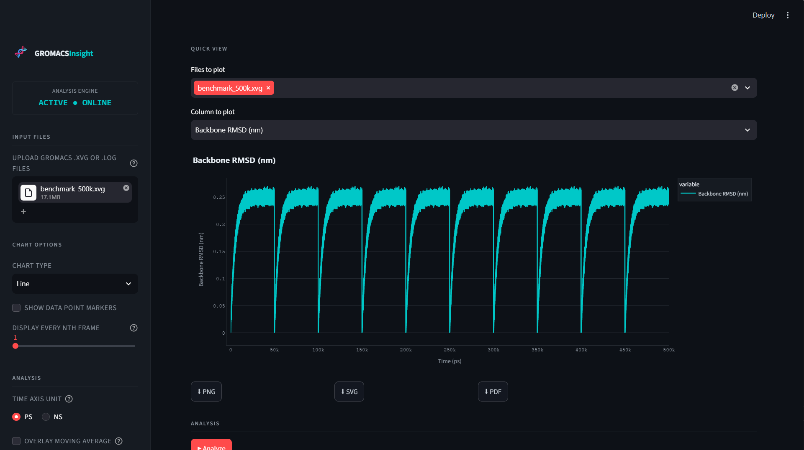
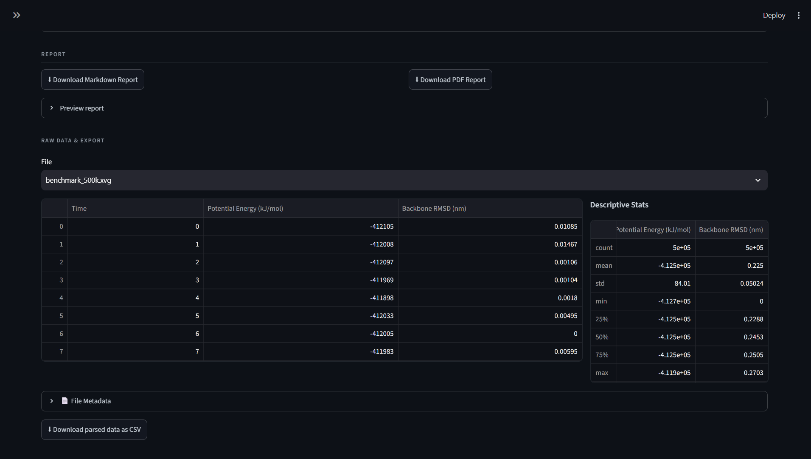

# GROMACS Insight Platform for gromacs-trajectory-displayer

[](https://gromacs-trajectory-displayer.readthedocs.io/en/latest/?badge=latest)

[](https://github.com/AyushmaanSingh941/gromacs-trajectory-displayer/actions)
[](https://codecov.io/gh/AyushmaanSingh941/gromacs-trajectory-displayer)

GROMACS Insight Platform is a Streamlit application for inspecting common GROMACS `.xvg` outputs (for example RMSD, RMSF, radius of gyration, SASA, hydrogen bonds, energy, temperature, and pressure) without writing custom notebooks.

It parses uploaded files, auto-detects metric type using filename/header heuristics, provides interactive plots, computes descriptive statistics, runs heuristic equilibration/stability checks, and exports Markdown/PDF reports.

## Supported File Types

This app accepts:

- **`.xvg`** — GROMACS/Grace-style analysis output (RMSD, RMSF, Rg, SASA, hydrogen bonds, energy, temperature, pressure, etc.)
- **`.log`** — GROMACS log files for supported metrics

It does **not** read raw trajectory files. Formats such as **`.xtc`** and **`.trr`** are not supported and cannot be uploaded directly — only the text-based, human-readable analysis output listed above is accepted. If you need to analyze a raw trajectory, first generate the relevant `.xvg`/`.log` output using the appropriate GROMACS analysis tool (e.g. `gmx rms`, `gmx rmsf`, `gmx gyrate`, `gmx sasa`), then upload that output here.

## Key Features

- Parse `.xvg` files with Grace-style headers and numeric tables
- Heuristic file-type detection from filename and axis/title text
- Interactive Plotly visualizations (line, scatter, area)
- Optional moving-average overlay and Y-axis log scale
- RMSF residue ranking for high-flexibility residues
- Heuristic equilibration estimate for time-series metrics
- Per-metric stability scoring and aggregate quality scoring
- Pairwise Welch t-test comparisons for same metric types
- Export parsed CSV, chart images (PNG/SVG/PDF), Markdown report, and PDF report

## Screenshots





## Real-World Use Case

A researcher has just finished a 100 ns molecular dynamics simulation of an engineered PETase enzyme that includes a designed rigid linker intended to stabilize two functional domains. To validate the design, they upload the run's `.xvg` outputs — RMSD, RMSF, and radius of gyration — into the platform. Using the interactive plots, they check whether the linker region shows low residue-level fluctuation in the RMSF plot and whether the overall RMSD and Rg trends flatten out after an initial equilibration period, rather than drifting upward over the full trajectory. This quick visual and statistical triage helps the researcher decide, in minutes rather than hours, whether the rigid-linker design appears to be behaving as intended before moving on to more rigorous, publication-grade analysis.

## Repository Layout

```text
app.py                  Streamlit UI and orchestration
src/
  __init__.py
  parser.py             XVG parsing and file-type detection
  statistics.py         Descriptive and comparative statistics
  analysis.py           Equilibration/stability heuristics and explainers
  visualization.py      Plotly figure builders and export helpers
  report.py             Markdown/PDF report generation
tests/
  test_parser.py
  test_statistics.py
  test_analysis.py
requirements.txt        Runtime and test dependencies
CONTRIBUTING.md         Contribution workflow
```

## Requirements

- Python 3.10+
- pip

## Installation

The easiest way to use the platform is to install it directly from PyPI:

```bash
pip install gromacs-trajectory-displayer
```

### Optional static image export dependency

Plotly static export via Kaleido requires a local Chrome/Chromium installation.

```bash
plotly_get_chrome
```

If Chrome is unavailable, the app still works; only static image export buttons fail gracefully.

## Run the App

```bash
streamlit run app.py
```

## Run Tests

```bash
pytest -q
```

## Supported Input Expectations

- Text files in GROMACS/Grace-like format
- Header lines starting with `#` or `@`
- Whitespace-separated numeric columns
- First column interpreted as time for time-series metrics
- RMSF detected as non-time-series and treated as residue-indexed data

## Scientific Scope and Limitations

This project is intended for exploratory analysis and fast triage, not as a standalone publication-grade statistical workflow.

- Equilibration detection is heuristic (block-based), not a replacement for statistical inefficiency methods (for example `pymbar.timeseries.detect_equilibration`).
- Quality score is a heuristic composite and should not be interpreted as proof of physical validity.
- Welch t-test outputs do **not** correct for MD time autocorrelation; p-values are approximate signals only.
- Interpret biological meaning from domain expertise and raw trajectory context, not from a single score.

## Contributing

See [CONTRIBUTING.md](CONTRIBUTING.md).

## License

This project is licensed under the [MIT License](LICENSE).